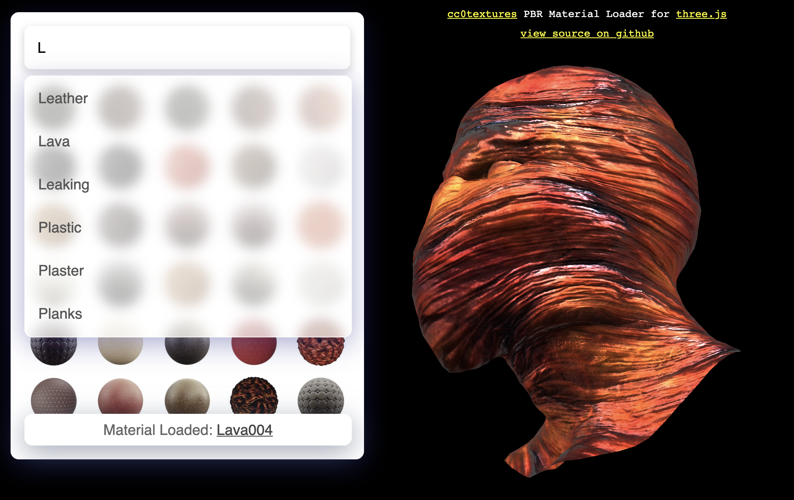

# CC0Textures threejs Material Loader
### PBR Material loader from cc0textures.

Demo - 
https://repalash.github.io/cc0textures-threejs/


Browse over 1000 PBR materials from cc0textures.com and use as `MeshStandardMaterial` or `MeshStandardMaterial` in three.js.

## Usage
Copy the files [cc0_threejs_loader.js](src/cc0_threejs_loader.js) and [cc0textures_helper.js](src/cc0textures_helper.js) to your project. 

Sample load material directly from the link (Get it from cc0textures.com)
```javascript
var mesh;
var loader = new CC0MaterialLoader();
loader.load('https://cdn3.struffelproductions.com/file/CC0-Textures/download/Ground019_01fsyirl/Ground019_1K-PNG.zip', (params)=>{
    mesh.material = new MeshStandardMaterial(params);
    // or
    mesh.material = new MeshPhysicalMaterial(params);
});
```
You can also use indirect link like: `https://cc0textures.com/get?file=Ground019_2K-JPG.zip`



It is possible to preload the data and find materials and create dynamic links (like in the example). The get complete data from [src/data](src/data)
```javascript
var mesh;
var materials_data = `Ground019,01fsyirl,1K-JPG|1K-PNG\nTiles064,nzs0hgad,1K-JPG\nRocks005,fsrk453n,1K-JPG`;

var loader = new CC0MaterialLoader(new THREE.LoadingManager(), materials_data);
loader.findAndLoad('ground', (params)=>{
    mesh.material = new MeshStandardMaterial(params);
    // or
    mesh.material = new MeshPhysicalMaterial(params);
})
```